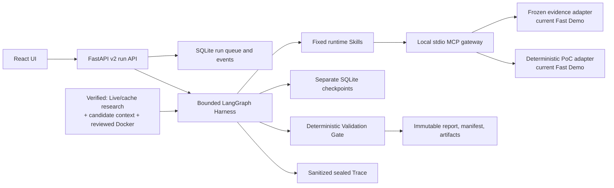

# MOMO TechScout

MOMO TechScout is an evidence-grounded research and verification agent for Python AI developers choosing open-source components. A task supplies the project environment, hard constraints, and candidate components; TechScout runs a bounded, checkpointed investigation and returns either a traceable recommendation, an explicit `no_safe_winner`, or a limited/failed result.

The current V1 family is deliberately narrow: local-RAG Python vector stores. Chroma and Qdrant Local have reviewed PoC recipes. pgvector and unknown candidates remain research-only unless a later decision adds a trusted fixture. The PoCs check small compatibility contracts; they do not certify production performance.

**Hero Demo 已验收：** 以 `origin/master@b7516a7b478834614f6ce2ccf1ae63a5c73c3140` 为实际运行基线的 Chromium 验收中，连续三次 Fast Demo 均在 120 秒预算内终态化，浏览器 wall-clock 分别为 **45.081 s、15.360 s、12.879 s**；验收记录与稳定性修复随后合入 PR #92（`7c6a9ed25b50f790d3a0b39a541e46258da71f5a`）。这是冻结 synthetic Fast Demo 的产品验收，不是 Live 模型质量或组件性能基准。

Final documentation authority includes PR #93 at `origin/master@ca7e65a3c1bcaa8e5da2e9b2776c615bceb74aab`. Its sealed audit authorizes the synthetic runner only as evaluation-infrastructure acceptance; all real-model/product Task Success, Recall, Recovery-rate, Token, latency, and Cost resume metrics are **N/A**.

## What works today

| Surface | Current status | Honest interpretation |
|---|---|---|
| Fast Demo (`mode=fast`) | Implemented | Runs the real bounded LangGraph Harness, fixed Skill router, local stdio MCP transport, checkpoints, deterministic gate, artifacts, and sealed Trace over frozen synthetic evidence and deterministic synthetic PoC responses. It makes no live provider, research-network, or Docker call. |
| Verified request (`mode=verified`) | Implemented for the bounded Hero Case | Uses bounded live research with explicit cache/unavailable provenance, candidate-scoped hybrid context, and reviewed Docker recipes for Chroma/Qdrant Local. Missing cache/provider/Docker capacity ends honestly as limited/no-safe-winner. |
| Offline fixture | Implemented | Immutable/simulated UI and API fixture for reviewing screens and contracts. It is not research output, a benchmark, or proof of Docker execution. |
| Live execution | Web-wired for the Hero Case | Chroma and Qdrant Local use reviewed recipes; pgvector and unknown candidates remain research-only. Real provider/Docker success still depends on local credentials and the explicitly enforced install network. |
| Evaluation | Infrastructure accepted; product-effect metrics N/A | PR #93 sealed the original failed precheck, one data-only amended synthetic run, its authority index, and the final audit. The recorded `12/40/8` values are diagnostics only—not resume or model/product-effect evidence. |

## Quick start: current Fast Demo

Prerequisites: Python 3.10+, Node.js `^20.19.0` or `>=22.12.0`, npm, and a local checkout. No provider key or Docker daemon is required for this path. Use a virtual environment so the `techscout` command and the Python used by repository scripts resolve the same installation.

Create and activate the environment:

```console
python -m venv .venv
```

On macOS or Linux:

```console
source .venv/bin/activate
```

On Windows PowerShell:

```powershell
.\.venv\Scripts\Activate.ps1
```

Then install, build, and serve:

```console
python -m pip install -e .
cd web
npm ci
npm run contracts:check
npm run build
cd ..
techscout serve
```

Open `http://127.0.0.1:8000`, submit a Fast Demo task, or open the synthetic offline fixture. Keep its synthetic labeling visible when presenting it. The server binds to loopback by default because the local product has no authentication.

For a Docker-based local start, use:

```console
docker compose up --build
```

Compose publishes only `127.0.0.1:8000`, persists local run data in a named volume, and does not mount the Docker socket. This starts the same synthetic Fast Demo Web path; it does not enable Live providers or sandbox-backed Verified execution.

If `techscout` is not found or a repository script reports a missing Python module after installation, reactivate the same `.venv` in the current shell. If Vite rejects the Node runtime, upgrade to one of the versions listed above. If Compose cannot connect to the Docker daemon, start Docker Engine or Docker Desktop and confirm both client and server versions appear in `docker version` before retrying.

`python -m paper_agent.web` remains a compatible Web entry point. The historical `paper-agent` command and `paper_agent` imports are also preserved for the Scholar workflow; they are not presented as a TechScout evaluation baseline.

The Web production assets are emitted into `paper_agent/web/static` and included
in the wheel. Build the Web application before creating a distributable wheel;
CI verifies the installed wheel from outside the checkout and checks both CLI
help and the loopback-served React root.

## Architecture



The deterministic gate—not model prose—controls publishability. Unknown recipes cannot cross the PoC boundary, unsupported critical recommendations are rejected, and recovery may repeat only the failed stage within the policy bound.

## Result semantics

- `completed`: the active execution boundary passed its required gates. For the current synthetic Fast Demo, this is fixture acceptance only—not a live component claim.
- `completed_with_limitations`: a useful report exists but evidence, provider, Docker, or verification coverage is incomplete.
- `failed`: no safe schema-valid report could be published.
- `no_safe_winner`: evidence or trusted verification did not cover the hard constraints; TechScout refuses to fabricate a recommendation.

## Documentation

- [Delivery status and documentation map](docs/techscout/README.md)
- [Architecture and artifact authority](docs/techscout/architecture.md)
- [Run modes and operator guide](docs/techscout/running.md)
- [V1 support matrix and security boundary](docs/techscout/support-and-safety.md)
- [Final evaluation and browser acceptance authority](docs/techscout/final-delivery.md)
- [Open-source reproduction gate](docs/acceptance/2026-08-27-open-source-reproduction-gate.md)
- [Interview story and four STAR resume drafts](docs/techscout/interview-and-resume.md)
- [Product-scope ADR](docs/decisions/0001-techscout-product-scope-and-support.md)

MOMO TechScout is licensed under AGPL-3.0; see `LICENSE` and `THIRD_PARTY_NOTICES.md`.
