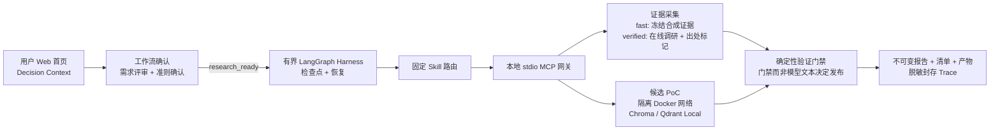
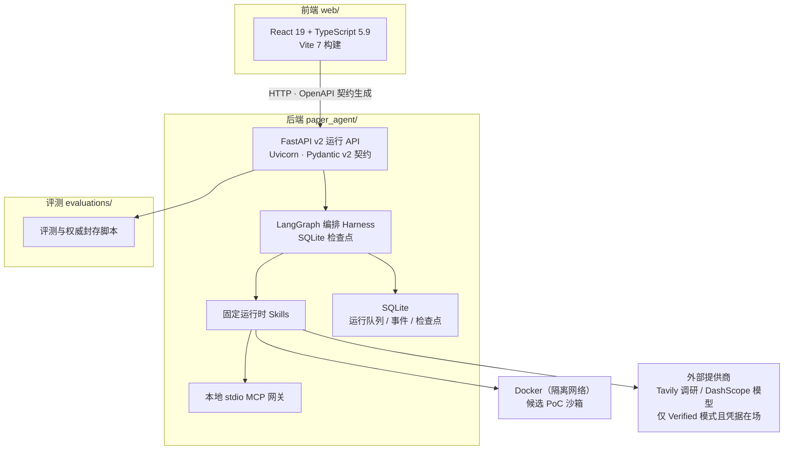
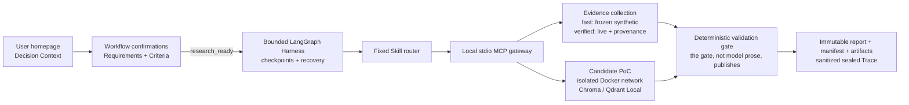
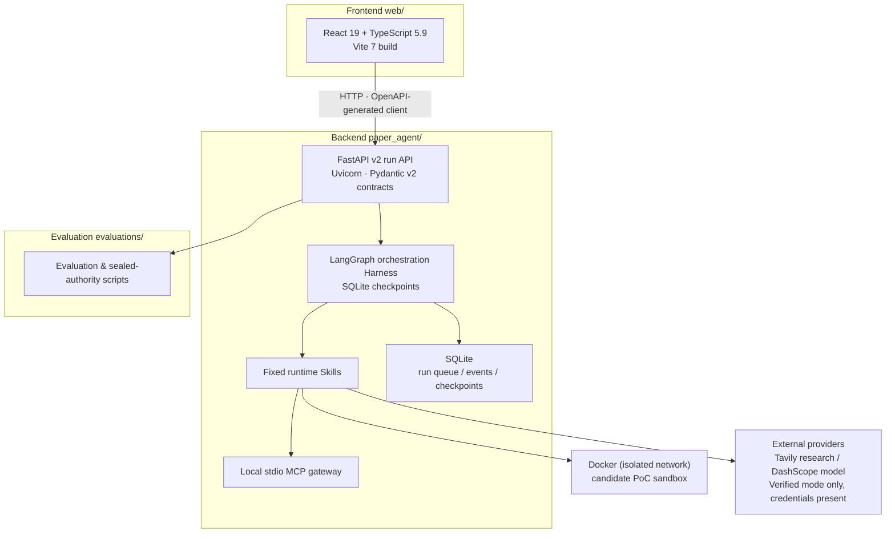

<div align="center">

# MOMO TechScout

[](LICENSE)
[](pyproject.toml)
[](pyproject.toml)
[](pyproject.toml)
[](web/package.json)
[](web/package.json)
[](web/package.json)
[](https://github.com/bluefateludi/MOMO-TechScout/actions/workflows/ci.yml)

**证据落地的开源组件调研与验证 Agent（面向 Python AI 开发者）**
**An evidence-grounded research & verification agent for Python AI developers**

</div>

---

> [!TIP]
> GitHub 不支持在 README 中运行脚本，无法做到"一键真正切换语言"。这里用 GitHub 原生折叠面板实现最接近的效果：点击下方标题条即可展开对应语言，再次点击收起。

<details open>
<summary><h2>🌐 中文（点击切换语言 / Click to switch language）</h2></summary>

<a id="readme-english"></a>
[English 版本](#readme-english)

## 这是什么

MOMO TechScout 是一个**证据落地的调研与验证 Agent**，服务场景：Python AI 开发者需要在几个开源组件中做选型。一次任务提供项目环境、硬性约束与候选组件；TechScout 跑一轮**有边界、带检查点**的调研，最后只返回三种结果之一：可溯源的推荐、明确的 `no_safe_winner`（无安全赢家）、或受限/失败结果。**它宁可承认"没有安全赢家"，也不编造推荐。**

当前 V1 范围刻意收窄：**本地 RAG 的 Python 向量库**。Chroma 与 Qdrant Local 已有经过评审的 PoC 配方；pgvector 和未知候选仍处于"仅调研"状态。PoC 只验证小型兼容性契约，**不认证生产性能**。

## 当前状态（诚实边界）

> [!IMPORTANT]
> 以下是本仓库验收文档的权威结论，中文版做了压缩，事实边界一条未少。完整依据见 [文档导航](#文档导航)。

| 能力面 | 当前状态 | 如实解读 |
|---|---|---|
| 公开 Web 决策工作流 | **卡在 M0 产品门禁** | 首页（简体中文）能收集并预览 Decision Context，但需求确认与准则确认**不持久化**；从首页提交的运行停留在 `queued`，需带外调用公开 Workflow API 才能继续。 |
| Fast Demo（`mode=fast`） | 已实现 | 在冻结合成证据与确定性合成 PoC 响应之上，跑真实的 LangGraph Harness、固定 Skill 路由、本地 stdio MCP 传输、检查点、确定性门禁、产物与封存 Trace。**不调用任何在线模型、调研网络或 Docker。** |
| Verified 请求（`mode=verified`） | 限定 Hero Case 内实现 | 有界的在线调研（逐条记录 `live`/`cache`/`unavailable` 出处）、候选范围混合上下文、Chroma/Qdrant Local 的已评审 Docker 配方。缓存/提供商/Docker 能力缺失时，诚实地以受限或 `no_safe_winner` 收场。 |
| 离线 Fixture | 已实现 | 不可变/模拟的 UI 与 API fixture，仅用于审阅界面与契约；不是调研产出、不是基准、也不证明 Docker 执行。 |
| 在线执行 | Hero Case 已接通 Web | Chroma 与 Qdrant Local 用已评审配方；pgvector 与未知候选仅调研。真实提供商/Docker 成功仍依赖本地凭据与显式强制隔离的安装网络。 |
| 评测 | 基础设施已验收；产品效果指标 N/A | PR #93 封存了原始失败预检、一次仅数据修正的合成运行、权威索引与终审。记录的 `12/40/8` 只是诊断数字，**不是**简历或产品效果证据。 |

- **Hero Demo 已验收**：以 `origin/master@b7516a7b` 为基线的 Chromium 验收中，连续三次 Fast Demo 均在 120 秒预算内终态化（45.081 s / 15.360 s / 12.879 s），验收与修复随后合入 PR #92。这是**冻结合成 Fast Demo 的产品验收**，不是 Live 模型质量或组件性能基准。
- **真实模型指标全部 N/A**：封存审计只授权合成 runner 作为评测基础设施验收；Task Success、Recall、Recovery-rate、Token、延迟、成本等真实模型/产品指标当前一律 **N/A**。

## 产品运行简要逻辑

一次 TechScout 运行的生命周期如下：

1. **提交任务** — 用户在 Web 首页（默认简体中文）填写项目环境、硬性约束与候选组件，形成 Decision Context。
2. **确认关口** — 经过需求评审与准则确认，工作流进入 `research_ready`。（当前 M0 门禁：这一步的确认尚未持久化，运行会停在 `queued`，需带外调用公开 Workflow API。）
3. **有界调研** — LangGraph Harness 驱动固定 Skill 路由，通过本地 stdio MCP 网关做证据采集：Fast 模式走冻结合成证据；Verified 模式做有界在线调研并逐条标记 `live`/`cache`/`unavailable` 出处。
4. **候选验证（PoC）** — 仅对有已评审配方的候选（Chroma、Qdrant Local）在隔离网络中运行 Docker PoC，验证小型兼容性契约。
5. **确定性门禁** — **门禁而不是模型文本**决定能否发布：未知配方不能越过 PoC 边界，缺少支撑的关键推荐被拒绝，恢复只允许在策略上限内重跑失败阶段。
6. **终态与产物** — 运行终态化为四选一（见[结果语义](#结果语义)），落盘不可变报告、清单、产物与脱敏封存 Trace，全程可溯源。



## 技术栈与架构



- **前端**：React 19 + TypeScript 5.9（Vite 7 构建），OpenAPI 契约生成类型化 API 客户端。
- **后端**：FastAPI + Pydantic v2 作为契约层；LangGraph 编排有界调查，检查点落 SQLite。
- **隔离边界**：候选 PoC 一律在独立的、目的地白名单的 Docker 网络中执行；在线提供商（Tavily 调研、DashScope 模型）只在 Verified 模式且凭据/授权在场时被调用。
- **构建产物**：Web 静态资源编译进 `paper_agent/web/static` 并随 wheel 分发；CI 会从 checkout 之外验证安装的 wheel。

### 目录结构

```text
MOMO-Scholar/
├── paper_agent/        # Python 后端：CLI、Web API、LangGraph Harness、
│   │                   # 检索 / 生成 / 评测 / 可观测性子模块
│   └── techscout/      # TechScout 产品核心（运行时、Skills、PoC、门禁）
├── web/                # React + TypeScript 前端（Vite）
├── docs/               # 权威文档：验收记录、架构、运行指南、决策记录
├── evaluations/        # 评测数据集、模板与封存权威
├── docker/             # 沙箱与 Web 的 Compose 定义
├── scripts/            # 构建 / 评测 / 封存脚本
├── openapi/            # 生成的 OpenAPI 契约
└── tests/              # 测试套件
```

## 快速开始（当前 Fast Demo）

前置条件：Python 3.10+、Node.js `^20.19.0` 或 `>=22.12.0`、npm、本地 checkout。**此路径不需要任何提供商密钥或 Docker 守护进程。** 建议使用虚拟环境，保证 `techscout` 命令与仓库脚本解析到同一个 Python 安装。

创建并激活环境：

```console
python -m venv .venv
```

macOS / Linux：

```console
source .venv/bin/activate
```

Windows PowerShell：

```powershell
.\.venv\Scripts\Activate.ps1
```

安装、构建并启动：

```console
python -m pip install -e .
cd web
npm ci
npm run contracts:check
npm run build
cd ..
techscout serve
```

打开 `http://127.0.0.1:8000` 查看 Decision Context 与审阅界面，或打开合成离线 fixture。在 M0 受检基线上，首页表单勾选五条可见审阅通道后提交会创建一个 `queued` 运行，但不会持久化执行所需的 Workflow 确认——页面已如实标注该审阅为 fixture 预览。**不要把这条路径当成已完成的公开旅程**，精确边界见 [M0 产品门禁权威](docs/acceptance/2026-08-27-m0-product-gate.md)。保持所有合成标注可见。服务器默认只绑定回环地址，因为本地产品没有鉴权。

基于 Docker 的本地启动：

```console
docker compose up --build
```

Compose 只发布 `127.0.0.1:8000`，本地运行数据持久化在命名卷中，不挂载 Docker socket。它启动的同样是合成 Fast Demo Web 路径，**不启用** Live 提供商或沙箱支撑的 Verified 执行。

`python -m paper_agent.web` 仍是兼容的 Web 入口。历史命令 `paper-agent` 与 `paper_agent` 导入为 Scholar 工作流保留，不作为 TechScout 评测基线呈现。

Web 生产资源输出到 `paper_agent/web/static` 并包含在 wheel 中。**创建可分发 wheel 前先构建 Web 应用**；CI 会从 checkout 之外验证安装的 wheel，并检查 CLI 帮助与回环服务的 React 根页面。

## 结果语义

- `completed` — 当前执行边界通过了必需门禁。对当前合成 Fast Demo 而言，这只是 fixture 验收，**不是**对真实组件的断言。
- `completed_with_limitations` — 存在有用报告，但证据、提供商、Docker 或验证覆盖不完整。
- `failed` — 无法发布任何安全的、schema 合规的报告。
- `no_safe_winner` — 证据或可信验证未覆盖硬性约束；TechScout 拒绝编造推荐。

## 常见问题（FAQ）

**Q：`techscout` 命令找不到，或仓库脚本报缺 Python 模块？**
A：在当前 shell 重新激活同一个 `.venv`，让 `techscout` 命令与脚本用上同一套安装。

**Q：Vite 拒绝当前 Node 运行时？**
A：升级到上面列出的 Node 版本之一（`^20.19.0` 或 `>=22.12.0`）。

**Q：Compose 连不上 Docker 守护进程？**
A：先启动 Docker Engine 或 Docker Desktop，确认 `docker version` 里 client 与 server 版本都出现后再重试。

**Q：怎么确认 Verified 模式是否就绪？**
A：运行 `techscout doctor`（只读启动检查，不调用任何提供商、不启动容器）。完整的 Verified Hero demo 需要 `TAVILY_API_KEY`、`DASHSCOPE_API_KEY`、Docker 与已评审安装网络同时就绪；**凭据本身不会授权付费模型调用**——真实决策/报告生成只由既有有界 Hero smoke 入口在冻结精确模型版本、token 上限、价格快照、正成本上限与单例范围后启用。

**Q：Fast Demo 的 `completed` 能证明某个真实候选可用吗？**
A：不能。它只证明 fixture 垂直切片通过；真实候选验证只在 Verified 模式的有界范围内发生。

## 文档导航

- [当前 M0 产品门禁权威](docs/acceptance/2026-08-27-m0-product-gate.md)
- [交付状态与文档地图](docs/techscout/README.md)
- [架构与产物权威](docs/techscout/architecture.md)
- [运行模式与操作指南](docs/techscout/running.md)
- [V1 支持矩阵与安全边界](docs/techscout/support-and-safety.md)
- [最终评测与浏览器验收权威](docs/techscout/final-delivery.md)
- [开源复现门禁](docs/acceptance/2026-08-27-open-source-reproduction-gate.md)
- [面试故事与四份 STAR 简历草稿](docs/techscout/interview-and-resume.md)
- [产品范围 ADR](docs/decisions/0001-techscout-product-scope-and-support.md)

MOMO TechScout 采用 AGPL-3.0 许可；见 `LICENSE` 与 `THIRD_PARTY_NOTICES.md`。

</details>

<details>
<summary><h2>🌐 English (Click to switch language / 点击切换语言)</h2></summary>

<a id="readme-chinese"></a>
[中文版本](#readme-chinese)

## What it is

MOMO TechScout is an evidence-grounded research and verification agent for Python AI developers choosing open-source components. A task supplies the project environment, hard constraints, and candidate components; TechScout runs a bounded, checkpointed investigation and returns either a traceable recommendation, an explicit `no_safe_winner`, or a limited/failed result. **It would rather admit "no safe winner" than fabricate a recommendation.**

The current V1 family is deliberately narrow: local-RAG Python vector stores. Chroma and Qdrant Local have reviewed PoC recipes. pgvector and unknown candidates remain research-only unless a later decision adds a trusted fixture. The PoCs check small compatibility contracts; they do not certify production performance.

## Current status (honest boundaries)

> [!IMPORTANT]
> Compressed from the repository's acceptance-document conclusions; no factual boundary removed. Full authorities are linked under [Documentation](#documentation).

| Surface | Current status | Honest interpretation |
|---|---|---|
| Public Web Decision Workflow | **Blocked at M0** | The homepage (Simplified Chinese default) can collect and preview a Decision Context, but does not persist the required Requirements Review and Criteria Confirmation. A run submitted from that page remains `queued` until the existing public Workflow API is called out of band. |
| Fast Demo (`mode=fast`) | Implemented | Runs the real bounded LangGraph Harness, fixed Skill router, local stdio MCP transport, checkpoints, deterministic gate, artifacts, and sealed Trace over frozen synthetic evidence and deterministic synthetic PoC responses. No live provider, research-network, or Docker call. |
| Verified request (`mode=verified`) | Implemented for the bounded Hero Case | Bounded live research with explicit `live`/`cache`/`unavailable` provenance, candidate-scoped hybrid context, and reviewed Docker recipes for Chroma/Qdrant Local. Missing cache/provider/Docker capacity ends honestly as limited/no-safe-winner. |
| Offline fixture | Implemented | Immutable/simulated UI and API fixture for reviewing screens and contracts. Not research output, a benchmark, or proof of Docker execution. |
| Live execution | Web-wired for the Hero Case | Chroma and Qdrant Local use reviewed recipes; pgvector and unknown candidates remain research-only. Real provider/Docker success still depends on local credentials and the explicitly enforced install network. |
| Evaluation | Infrastructure accepted; product-effect metrics N/A | PR #93 sealed the original failed precheck, one data-only amended synthetic run, its authority index, and the final audit. The recorded `12/40/8` values are diagnostics only—not resume or product-effect evidence. |

- **Hero Demo accepted**: in Chromium acceptance against `origin/master@b7516a7b`, three consecutive Fast Demos terminalized within the 120 s budget (45.081 s / 15.360 s / 12.879 s); acceptance and fixes merged in PR #92. This is product acceptance of the frozen synthetic Fast Demo, not a Live-model-quality or component-performance benchmark.
- **All real-model metrics N/A**: the sealed audit authorizes the synthetic runner only as evaluation-infrastructure acceptance; real-model Task Success, Recall, Recovery-rate, Token, latency, and Cost metrics are currently **N/A**.

## How a run works

The lifecycle of one TechScout run:

1. **Submit** — the user fills in project environment, hard constraints, and candidate components on the (Chinese-default) homepage, forming a Decision Context.
2. **Confirmation gates** — Requirements Review and Criteria Confirmation move the workflow to `research_ready`. (Current M0 gate: these confirmations are not persisted; a run stays `queued` until the public Workflow API is called out of band.)
3. **Bounded research** — the LangGraph Harness drives a fixed Skill router through a local stdio MCP gateway: Fast mode reads frozen synthetic evidence; Verified mode does bounded live research and marks each source `live`/`cache`/`unavailable`.
4. **Candidate PoC** — only candidates with reviewed recipes (Chroma, Qdrant Local) run Docker PoCs in an isolated network, checking small compatibility contracts.
5. **Deterministic gate** — the gate, not model prose, decides publishability: unknown recipes cannot cross the PoC boundary, unsupported critical recommendations are rejected, and recovery may repeat only the failed stage within the policy bound.
6. **Terminal state & artifacts** — the run terminalizes into one of four outcomes (see [Result semantics](#result-semantics)) and writes immutable report, manifest, artifacts, and a sanitized sealed Trace.



## Tech stack & architecture



- **Frontend**: React 19 + TypeScript 5.9 (Vite 7), with an OpenAPI-contract-generated typed API client.
- **Backend**: FastAPI + Pydantic v2 as the contract layer; LangGraph orchestrates the bounded investigation with SQLite checkpoints.
- **Isolation boundary**: candidate PoCs always run in a dedicated, destination-allowlisted Docker network; live providers (Tavily research, DashScope model) are called only in Verified mode with credentials and authorization present.
- **Build artifacts**: Web static assets are compiled into `paper_agent/web/static` and shipped in the wheel; CI verifies the installed wheel from outside the checkout.

### Directory layout

```text
MOMO-Scholar/
├── paper_agent/        # Python backend: CLI, Web API, LangGraph Harness,
│   │                   # retrieval / generation / eval / observability
│   └── techscout/      # TechScout product core (runtime, Skills, PoC, gate)
├── web/                # React + TypeScript frontend (Vite)
├── docs/               # Authority docs: acceptance, architecture, run guide, ADRs
├── evaluations/        # Eval datasets, templates, sealed authorities
├── docker/             # Compose definitions for sandbox and web
├── scripts/            # Build / evaluation / sealing scripts
├── openapi/            # Generated OpenAPI contracts
└── tests/              # Test suite
```

## Quick start: current Fast Demo

Prerequisites: Python 3.10+, Node.js `^20.19.0` or `>=22.12.0`, npm, and a local checkout. **No provider key or Docker daemon is required for this path.** Use a virtual environment so the `techscout` command and the Python used by repository scripts resolve to the same installation.

Create and activate the environment:

```console
python -m venv .venv
```

On macOS or Linux:

```console
source .venv/bin/activate
```

On Windows PowerShell:

```powershell
.\.venv\Scripts\Activate.ps1
```

Then install, build, and serve:

```console
python -m pip install -e .
cd web
npm ci
npm run contracts:check
npm run build
cd ..
techscout serve
```

Open `http://127.0.0.1:8000` to inspect the Decision Context and review UI, or open the synthetic offline fixture. On the M0-inspected baseline, submitting the homepage form after checking all five visible review lanes creates a queued run but does not persist the Workflow confirmations needed to execute it—the page truthfully labels that review as a fixture preview. **Do not present that path as a completed public journey**; see the [M0 Product Gate authority](docs/acceptance/2026-08-27-m0-product-gate.md). Keep all synthetic labeling visible. The server binds to loopback by default because the local product has no authentication.

For a Docker-based local start:

```console
docker compose up --build
```

Compose publishes only `127.0.0.1:8000`, persists local run data in a named volume, and does not mount the Docker socket. This starts the same synthetic Fast Demo Web path; it does **not** enable Live providers or sandbox-backed Verified execution.

`python -m paper_agent.web` remains a compatible Web entry point. The historical `paper-agent` command and `paper_agent` imports are preserved for the Scholar workflow; they are not presented as a TechScout evaluation baseline.

The Web production assets are emitted into `paper_agent/web/static` and included in the wheel. **Build the Web application before creating a distributable wheel**; CI verifies the installed wheel from outside the checkout and checks both CLI help and the loopback-served React root.

## Result semantics

- `completed` — the active execution boundary passed its required gates. For the current synthetic Fast Demo, this is fixture acceptance only, not a live component claim.
- `completed_with_limitations` — a useful report exists but evidence, provider, Docker, or verification coverage is incomplete.
- `failed` — no safe schema-valid report could be published.
- `no_safe_winner` — evidence or trusted verification did not cover the hard constraints; TechScout refuses to fabricate a recommendation.

## FAQ

**Q: `techscout` not found, or a repository script reports a missing Python module?**
A: Reactivate the same `.venv` in the current shell so the `techscout` command and scripts resolve the same installation.

**Q: Vite rejects the Node runtime?**
A: Upgrade to one of the Node versions listed above (`^20.19.0` or `>=22.12.0`).

**Q: Compose cannot connect to the Docker daemon?**
A: Start Docker Engine or Docker Desktop, confirm both client and server versions appear in `docker version`, then retry.

**Q: How do I check Verified-mode readiness?**
A: Run `techscout doctor` (a read-only startup check; calls no provider, starts no container). The complete Verified Hero demo requires `TAVILY_API_KEY`, `DASHSCOPE_API_KEY`, Docker, and the reviewed install network to be ready. **A credential alone never authorizes a paid model call**—real decision/report generation is enabled only by the existing bounded Hero smoke entry after it freezes an exact immutable model revision, token ceilings, a pricing snapshot, a positive cost ceiling, and one-case execution scope.

**Q: Does a Fast Demo `completed` prove a real candidate works?**
A: No. It proves the fixture vertical slice passed; real-candidate verification happens only within the bounded Verified scope.

## Documentation

- [Current M0 Product Gate authority](docs/acceptance/2026-08-27-m0-product-gate.md)
- [Delivery status and documentation map](docs/techscout/README.md)
- [Architecture and artifact authority](docs/techscout/architecture.md)
- [Run modes and operator guide](docs/techscout/running.md)
- [V1 support matrix and security boundary](docs/techscout/support-and-safety.md)
- [Final evaluation and browser acceptance authority](docs/techscout/final-delivery.md)
- [Open-source reproduction gate](docs/acceptance/2026-08-27-open-source-reproduction-gate.md)
- [Interview story and four STAR resume drafts](docs/techscout/interview-and-resume.md)
- [Product-scope ADR](docs/decisions/0001-techscout-product-scope-and-support.md)

MOMO TechScout is licensed under AGPL-3.0; see `LICENSE` and `THIRD_PARTY_NOTICES.md`.

</details>
