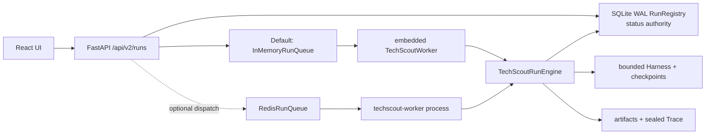

# 后端可靠性架构

## 1. 权威与结论

- 已合并事实基线：`750b17a`。
- 未合并实现权威：Draft PR #102，精确 head `595b506501b1b893b33845e50b17fc06ae267e75`。
- 最终离线/确定性独立复审 Standards/Spec 均 Pass、0 阻断；PR 尚未合并、未上线，也未运行真实 Redis server 集成。

SQLite WAL `RunRegistry` 仍是任务状态权威。默认本地模式使用 InMemory dispatch 和嵌入式 Worker；可选模式用 Redis 做 dispatch、lease、heartbeat、rate limit、reaper 与 dead-letter routing，并通过独立 `techscout-worker` 进程执行。Redis key 不是 run 状态或业务产物权威。

## 2. 已实现（基线）

`750b17a` 已实现 FastAPI、SQLite WAL registry、append-only events、单后台线程、Harness checkpoint、stage workspace、失败投影、sealed Trace 和确定性 gate。产物/Trace 先发布，随后在 SQLite 事务中提交 projection path、终态和终态事件；文件系统与 SQLite 之间仍没有跨资源事务。

## 3. PR #102 已实现并通过独立复审

已验收的代码面：

- `RunQueue` 接口和确定性 `InMemoryRunQueue`；默认体验仍是单进程嵌入式 Worker。
- `RedisRunQueue` 使用 Lua 原子维护 pending/processing、lease token、expiry、heartbeat、ack/retry、reaper、rate limit 与 dead-letter 数据。
- API 可通过 `--redis-url` 关闭嵌入式 Worker；`techscout-worker` 使用相同 Registry/output root 运行独立执行进程。
- Registry 事务化保存 idempotency key/request hash、deadline、attempt count、cancel intent、worker ID、错误 kind/code 和扩展终态。
- 相同 idempotency key + 相同请求返回同一 run；请求摘要不同返回 `idempotency_conflict`。
- queued/running 取消、Fast/Verified deadline、transient retry/DLQ 和 `timed_out` 终态。
- `/health/live`、`/health/ready`、`X-Request-ID`、上下文结构化日志和 credential/token 脱敏已实现。
- SIGINT/SIGTERM 停止进程入口并等待当前有界工作结束。

最终验收记录：聚焦 `19 passed`、Web `82 passed`、TechScout `125 passed / 2 skipped`，secret canary、Ruff、OpenAPI/TypeScript 合同和 Web build 通过。

## 4. 一致性语义

- Worker delivery 明确为 **at least once**，不宣称 exactly once。
- Registry 的条件 claim 拒绝重复执行已经非 queued 的 run；Redis 只负责投递协调。
- Redis lease token 会校验 heartbeat、ack、retry、dead-letter 和 reaper 的队列变更。
- worker ID、lease token、absolute lease expiry 和单调 fencing token 写入 Registry；heartbeat/progress/failure/terminal 通过完整 owner tuple CAS。
- 取消/deadline 终态优先级、duplicate ack、每请求 readiness、queue failure supervision/backoff 和 fatal worker exit 已通过确定性复审。
- Redis reaper 已提交但响应丢失时，新 delivery 仅能在 Registry lease expiry 后原子 takeover；ambiguous-success 原始重放最终 `completed`，旧 owner 被 fencing 拒绝。
- shutdown 无法安全硬终止阻塞的 Python 外部 I/O 线程；PR #102 采用有限 grace 后 fencing/handoff，并暴露 `active_external_io_not_terminated` limitation。
- 真实 Redis server、API/Worker 多进程竞态、网络分区和 Redis 重启未实际集成验证。

## 5. 未实现或未验证

- 真实 Redis server 集成测试、Redis Cluster/Sentinel、TLS/ACL、持久化与容量验证。
- 真实 Redis Lua 执行、网络响应丢失和真实 API/Worker 多进程竞争；当前证据来自确定性 adapter/重放。
- OS SIGKILL 与阻塞外部 I/O 的硬终止；Python 线程只能 fencing/handoff，不能安全 hard-kill。
- 产物存储与 SQLite 的跨资源原子提交。
- 多机共享 checkpoint/产物存储、跨主机部署和故障转移。
- DLQ 管理/重放 CLI、延迟指数退避、公平优先级和租户配额。
- 认证、多租户隔离、生产 SLO、告警、备份恢复和灾备目标。
- 真实模型效果与 Live Eval；不从 synthetic 或可靠性测试推断模型质量。

## 6. 代码事实入口

- PR #102：`paper_agent/web/task_queue.py`、`worker.py`、`techscout_worker.py`、`registry.py`、`errors.py`、`structured_logging.py`、`app.py`。
- 确定性测试：`tests/web/test_backend_reliability.py`、`test_techscout_api.py`。
- 实现说明：PR #102 中的 `docs/techscout/backend-reliability.md`。
