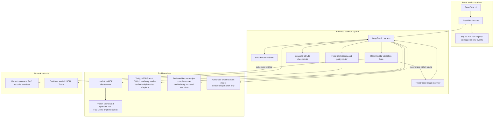

# Architecture and artifact authority

## Implemented vertical slice

The graph is intentionally bounded rather than an open-ended ReAct loop. Code owns state transitions, tool permissions, budgets, recipe compilation, gate decisions, and terminal status. Stage services own research/planning behavior. Model output, when connected, cannot override these controls.

The real Hero smoke begins at the public Decision Context endpoint and remains
blocked until Requirements Review and Criteria Confirmation establish Research
Ready. A provider key by itself cannot enable model execution. The bounded smoke
authorization supplies the exact model revision and token/cost ceilings; the
provider response must echo that revision and positive token usage. Missing or
drifting model authority produces an honest limited result with a sealed Trace.

## Stage and context boundaries

| Stage | Context admitted | Output contract |
|---|---|---|
| Intake/planning | Normalized request, environment, hard constraints, candidate identities, Skill summaries | Typed research plan |
| Research | One candidate, relevant constraints, bounded source metadata and search history | Normalized source/chunk/evidence identifiers |
| PoC planning | Candidate/version evidence and trusted recipe schema only | Structured `PocPlan`; no raw shell text |
| Verification | Structured plan compiled through the closed recipe registry | Typed PoC result or research-only disposition |
| Validation/reporting | Evidence index, PoC results, limitations, failures, manifest requirements | `recommended` or `no_safe_winner`; terminal manifest |

Raw pages, unrelated candidates, secrets, and arbitrary repository content are not meant to be copied into every prompt. Sources carry stable identifiers, timestamps, and content hashes.

## Authority hierarchy

1. A terminal manifest and its immutable artifact hashes are run authority.
2. The sealed local Trace is execution/provenance authority, subject to its allowlisted schema and sanitizer.
3. SQLite stores authoritative run status, discovery, progress, idempotency, attempts, deadlines, cancellation, and event projections; it does not rewrite the immutable artifacts. The default local composition uses an in-memory dispatch queue. Optional Redis-backed deployment uses Redis only for dispatch, leases, heartbeats, rate limiting, and dead-letter routing, with at-least-once delivery.
4. Synthetic fixtures establish deterministic contract behavior only.
5. A sealed non-synthetic evaluation package, after offline verification, is the required authority for model/product-effect metrics such as Task Success, Recall, Token, and Cost. Browser acceptance and scoped test/CI records remain separate authorities for engineering-delivery claims.

Optional OTLP export is a secondary observability sink. Export failure must not change local terminal artifacts. Evaluation outputs include resolved configuration, environment, case-level records, summary, resume projection, and a sealed manifest. The available runner diagnostics use synthetic fixtures, so their model/product-effect and resume authority is **N/A**.

## Failure semantics

Search/cache, tool-schema, dependency, PoC, report, deadline, and unsafe-operation failures are typed. Recovery is local to the failed stage and linked to a checkpoint; completed work is reused where valid. If the policy bound is exhausted, the product publishes an honest limited artifact or fails safely. It does not restart indefinitely or infer incompatibility from missing infrastructure.

## Generic Experiment Recipe engine tracer bullet

The generic Experiment module is a deeper orchestration layer over the existing sandbox seam; it is not a second command or container executor. Its public interface accepts an `ExecutionRequest`, a run workspace, and an optional cooperative cancellation token, and returns one content-sealed terminal contract. A `SandboxExperimentAdapter` translates each reviewed Recipe Check into the existing structured `CompiledCommand` and delegates to the existing `SandboxRunner`. Docker argv construction, network denial, CPU/memory/PID/disk limits, output bounds, timeout cleanup, and fake-runner substitution therefore remain in one module.

The first closed registry deliberately contains no vector-store or candidate identity. It provides:

- an explicit Research-only Recipe that never crosses the runner seam; and
- one safe offline Python-runtime Recipe that performs two fixed, no-network Checks.

Every executable Recipe is versioned and content-hashed. Each Check writes a sanitized, content-addressed Experiment Artifact; standard duration and exit-code Measurements link back to that Artifact. The Execution Budget limits Check count, total wall time, per-Check time, sandbox resources, Artifact bytes, and Measurement count. Any cancellation, timeout, non-zero exit, unavailable runner, budget exhaustion, adapter rejection, or cleanup failure ends in an immutable typed failure inside the same sealed terminal contract. No failed Check is automatically retried.

Idempotency is scoped to a run workspace. Reusing the same idempotency key with the same immutable request returns the stored seal without another runner call; using it for a different request fails closed. A lock prevents concurrent duplicate execution. The current tracer bullet intentionally does not wire this module into the Harness, MCP, API, or UI, and it does not replace the candidate-specific `RealPocService` compatibility path. A host-process crash before terminal publication can leave an in-progress lock that requires later operator-controlled recovery; automatic stale-lock deletion is deferred because it could duplicate a still-running external command.
